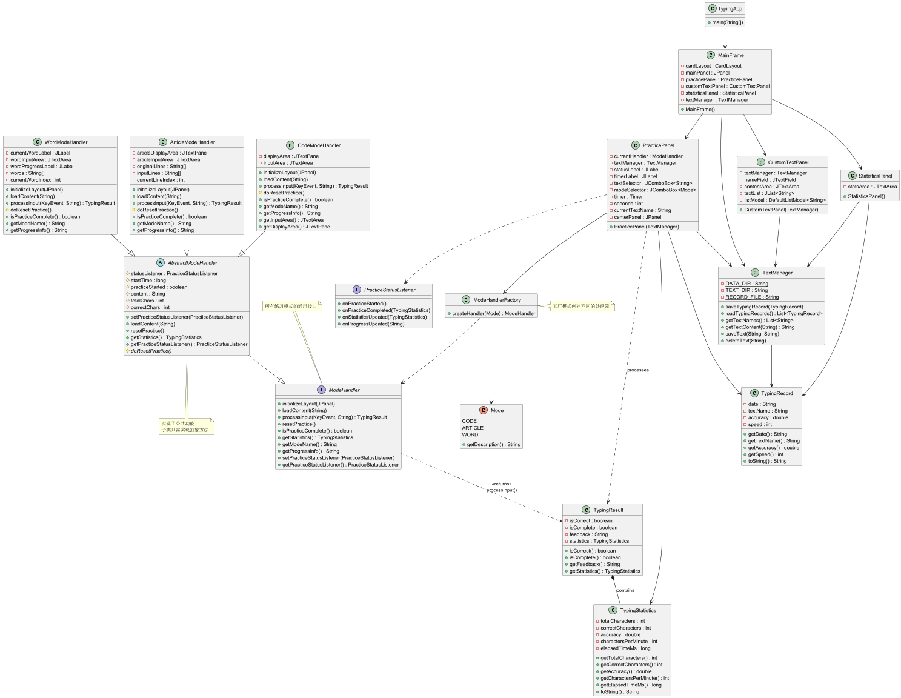

# MarsFun
---

## 项目简介
这是一个基于 Java Swing 的打字练习程序，旨在帮助用户通过多种练习模式提高打字速度和准确性。程序提供了代码模式、文章模式和单词模式等多种练习方式，并支持自定义文本、练习记录统计等功能。（学生练习制作的小项目哈，欢迎批评指正！）

## 功能特性
- **多种练习模式**
  - **代码模式**：通过输入代码片段练习打字，支持彩色文本显示正确与错误字符。
  - **文章模式**：逐行输入文章内容，实时反馈输入正确性。
  - **单词模式**：逐词输入练习，支持多语言文本。
- **自定义文本**
  - 用户可以添加、删除和编辑练习文本。
- **练习记录统计**
  - 自动保存练习记录，包括练习日期、文本名称、准确率和速度。
  - 提供统计信息面板，展示历史练习记录和平均数据。
- **用户友好界面**
  - 使用 Java Swing 构建。
  - 提供清晰的进度反馈和实时统计信息。

## 运行环境
- **Java**：需要安装 JDK 1.8 或更高版本。
- **操作系统**：支持 Windows、macOS 和 Linux。

## 项目结构

### 入口点
- `TypingApp.java`：程序入口点，负责启动应用程序。

### 主窗口与面板
- `MainFrame.java`：主窗口类，负责初始化和切换各个功能面板。
  - `PracticePanel.java`：练习面板，提供练习模式选择和练习功能。
  - `CustomTextPanel.java`：自定义文本面板，用于管理练习文本。
  - `StatisticsPanel.java`：统计面板，展示练习记录和统计信息。

### 练习模式
- `ModeHandler.java`：练习模式接口，定义了练习模式的基本行为。
  - `AbstractModeHandler.java`：抽象类，实现了 `ModeHandler` 接口，为具体模式提供公共功能。
    - `CodeModeHandler.java`：实现代码模式的具体逻辑。
    - `ArticleModeHandler.java`：实现文章模式的具体逻辑。
    - `WordModeHandler.java`：实现单词模式的具体逻辑。

### 数据模型
- `TypingRecord.java`：表示一次练习记录的数据模型。
- `TypingStatistics.java`：表示练习统计信息的数据模型。
- `TypingResult.java`：表示一次输入处理结果的数据模型。

### 监听器与工厂
- `PracticeStatusListener.java`：监听练习状态变化的接口。
- `ModeHandlerFactory.java`：用于创建练习模式处理器实例的工厂类。

### 管理器
- `TextManager.java`：管理练习文本和练习记录的存储与加载。

## 使用方法
1. **启动程序**
   运行程序后，主窗口将显示欢迎界面，提供“开始练习”、“自定义文本”和“查看统计”等选项。
2. **开始练习**
   - 选择“打字练习”进入练习面板。
   - 选择练习模式（代码、文章或单词）和练习文本。
   - 点击“开始练习”按钮开始练习。
   - 练习完成后，将弹出完成对话框，显示练习结果。
3. **自定义文本**
   - 选择“自定义文本”进入自定义文本面板。
   - 可以添加、编辑或删除练习文本。
4. **查看统计**
   - 选择“统计信息”进入统计面板。
   - 查看历史练习记录和平均统计信息。

## 注意事项
- 确保在运行程序前已正确安装 Java 环境。
- 如果需要支持更多语言，请确保系统已安装相应的字体。
- 练习记录将保存在项目目录下的 `data` 文件夹中，不要随意删除该文件夹。
